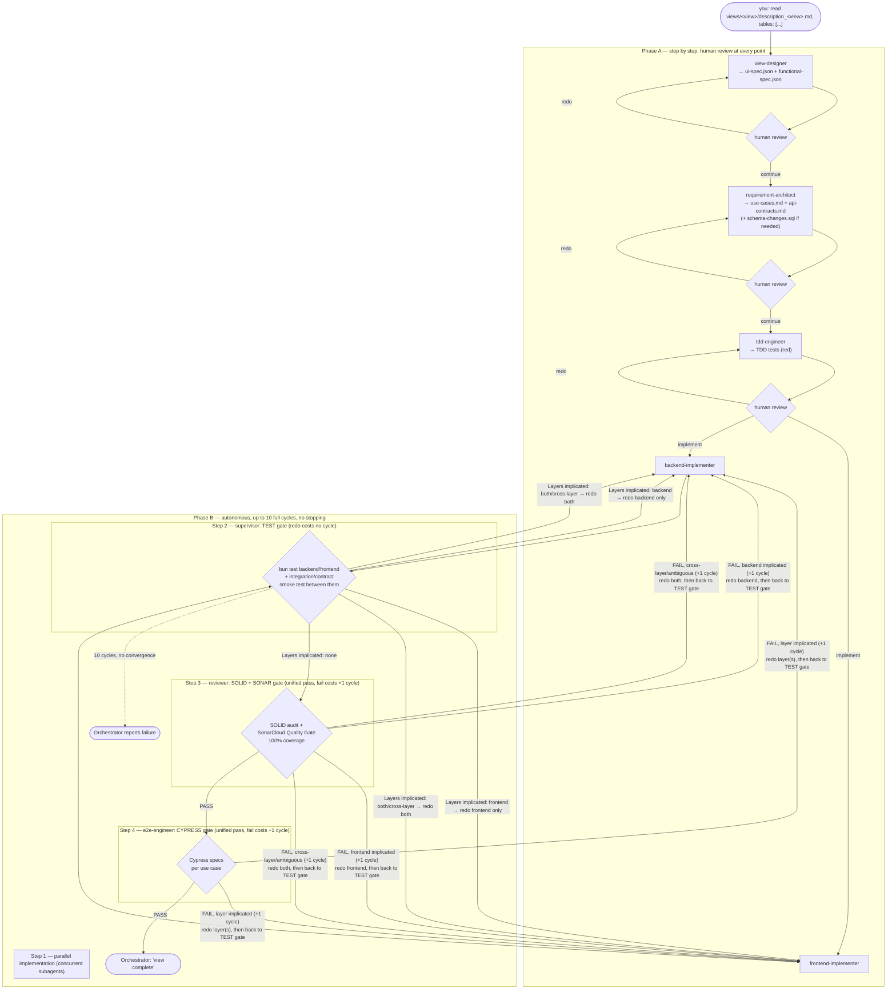

alwaysApply: true

# CLAUDE.md

## Project

**PYTO_BASE_PARA_GENERAR_PROYECTOS** — a generic, domain-agnostic framework for generating
web applications one view at a time, through a pipeline of Claude Code agents coordinated
by a conversational Orchestrator, backed by a real PostgreSQL database and (eventually) a
RAG system that gives context across views.

It does not generate a concrete application by itself: every use of this framework starts a
new project, view by view, from natural-language descriptions the user writes — no visual
mockup, no predefined domain.

Author: David Betancor.

## Core Rules

- **One view at a time.** The Orchestrator never chains design-phase agents without
  explicit human approval between them (see "Pipeline" below).
- **TDD.** Tests are written red before the implementation.
- **Type safety.** All code fully typed — no `any`, no implicit returns, no untyped
  parameters.
- **Clear naming.** Descriptive names. No premature abstraction. No unused code.
- **Question assumptions.** Flag repeated patterns and potential inconsistencies.
- **No pretend mechanisms.** If something is documented as working, it actually works. If
  something is planned but not built, say so explicitly — never leave an empty stub
  implying a mechanism that doesn't exist.

## Language

All technical artifacts in English: code, comments, TypeScript types and interfaces, error
messages, logs, docs, config, git commits, test names, schema names.

User-facing strings and domain vocabulary may use the language of the concrete project
being generated (e.g. Spanish, if that's the target app's audience) — this framework
imposes neither a domain nor a business language. Everything else in this repository is
always English, with no exceptions carved out by location: this file, agent roles, slash
commands, patterns, docs, tech-decision notes, and config.

## Response Style

- Read existing files before writing. Don't re-read unless changed.
- Thorough in reasoning, concise in output.
- Skip files over 100KB unless required.
- No sycophantic openers or closing fluff.
- No emojis or em-dashes.
- Do not guess APIs, versions, flags, commit SHAs, or package names. Verify by reading
  code or docs before asserting.

## Tech Stack

| Layer | Technology |
|-------|------------|
| Agent execution | Claude Code — slash commands point to a role file in `lib/agents/*/*.md`; Claude Code adopts that persona and runs it directly in-session |
| Coordination | **Orchestrator** agent (`lib/agents/orchestrator/`) — single conversational entry point, decides which agent to run and manages checkpoints (see "Pipeline") |
| Artifact storage | Local filesystem (`views/`, `src/`) — no intermediate database for the pipeline itself |
| Application database | **PostgreSQL 16**, real and live, already created by the user — `DATABASE_URL` pending configuration (see `.env.example`) |
| Postgres client | **`Bun.SQL`** native driver — no `pg`/node-postgres, no ORM (see `tecnologias/tecnologia_bbdd.md`) |
| Backend | **Bun** + Express 5 + TypeScript |
| Pipeline artifact validation | Zod (`lib/schemas/`) |
| Frontend | Web Components (native) + standalone lit-html + Tailwind CSS 3.x + TypeScript |
| Frontend build | `bun build` — `src/frontend/src/*.ts` → `src/frontend/dist/*.js` → `<script type="module">` |
| Unit tests | `bun test` (Jest-compatible API) — backend + frontend |
| E2E tests | Cypress — `src/frontend/cypress/e2e/` |
| Code quality | SOLID (manual audit by the `reviewer` agent) + SonarCloud (100% coverage required) |
| RAG *(planned, not built)* | `knowledge_base` with pgvector + embeddings, to give context across views — see "RAG" below |
| CI/CD | GitHub Actions (`ci-setup` generates the workflows) |
| Docs | MkDocs + Material for MkDocs, published to GitHub Pages |

## Pipeline

Every view goes through two phases with opposite control rules, coordinated by the
**Orchestrator** (`/orchestrator`) — the user doesn't invoke the other agents directly in
normal use.

```
Phase A — step by step, human review required at every point
  you: "read views/<view>/description_<view>.md, tables: [...]"
    → view-designer          → ui-spec.json + functional-spec.json → human review → redo | continue
    → requirement-architect   → use-cases.md + api-contracts.md (+ schema-changes.sql if needed) → human review → redo | continue
    → tdd-engineer            → TDD tests (red) → human review → redo | "implement"

Phase B — autonomous, up to 10 full cycles, no stopping
    → backend-implementer + frontend-implementer (run in parallel)
    → supervisor (per-layer unit tests + integration/contract smoke test between the two)
         Layers implicated: none → reviewer (SOLID + SonarCloud, 100% coverage gate, unified pass)
         Layers implicated: backend|frontend|both/cross-layer → re-dispatch only what's implicated (doesn't consume a cycle) → back to supervisor
    → reviewer
         fail → redo the layer(s) review-report.md implicates (both if cross-layer/ambiguous); cycle += 1; back to supervisor gate
         pass → e2e-engineer (Cypress, unified pass)
              fail → redo the layer(s) its report implicates (both if ambiguous); cycle += 1; back to supervisor gate
              pass → Orchestrator announces: "view complete"
    → after 10 cycles without converging → Orchestrator reports the failure
```



The TEST gate isn't just "each layer's own unit tests" — `backend-implementer` and
`frontend-implementer` write concurrently from the same `api-contracts.md` without talking
to each other mid-task, so `supervisor` also runs a lightweight integration/contract smoke
test (real HTTP calls against the running backend, checked against what the frontend
actually calls and expects) before declaring `Layers implicated: none`. This is the first
point where the two layers are checked against each other — cheaper than discovering a
wire-level mismatch only when `e2e-engineer`'s full Cypress run fails later.

Every redo — whether triggered by the TEST gate, the SOLID+SONAR gate, or the CYPRESS
gate — always re-enters through `backend-implementer`/`frontend-implementer`, whose only
forward edge is back into the TEST gate (`supervisor`). So a `reviewer`/`e2e-engineer`
failure never re-runs the same gate directly on the just-patched code: it always confirms
the fix's own unit tests (and the integration smoke test) pass first, then proceeds. Only
`supervisor`-triggered redos are free (no cycle cost); a `reviewer` or `e2e-engineer` FAIL
is what advances `current_cycle`.

There is no visual mockup and no external element numbering. Every element of a view gets
an **`elementId`** (kebab-case string) assigned by `view-designer` — this is the identifier
that runs through the rest of the pipeline: `ui-spec.json → functional-spec.json →
use-cases.md → tests → code`.

### Agents

| Agent | Responsibility | Input | Output |
|-------|-----------------|-------|--------|
| `orchestrator` | Single entry point; decides which agent to run, manages human review (Phase A) and the autonomous loop (Phase B, max. 10 cycles) | User instruction + view state | Notifications to the user at every checkpoint |
| `view-designer` | Designs the UI and behavior of a view from its natural-language description; introspects the real DB if `DATABASE_URL` is configured | `views/<view>/description_<view>.md` | `views/<view>/ui-spec.json` + `views/<view>/functional-spec.json` |
| `requirement-architect` | Use cases + API contracts + incremental schema changes if the view needs them | `ui-spec.json` + `functional-spec.json` | `views/<view>/use-cases.md` + `views/<view>/api-contracts.md` (+ `schema-changes.sql`) |
| `tdd-engineer` | Red unit tests from the acceptance criteria | `use-cases.md` + `api-contracts.md` | `src/{backend,frontend}/tests/*.test.ts` |
| `backend-implementer` | Backend code only, dispatched as a concurrent subagent alongside `frontend-implementer` during Phase B | Red backend tests + `api-contracts.md` + `schema-changes.sql` | `src/backend/src/` |
| `frontend-implementer` | Frontend code only, dispatched as a concurrent subagent alongside `backend-implementer` during Phase B | Red frontend tests + `ui-spec.json` + `functional-spec.json` + `api-contracts.md` (read-only) | `src/frontend/src/` |
| `supervisor` | Per-layer unit tests + an integration/contract smoke test between backend and frontend, after the parallel implementation step; tells the Orchestrator which layer(s), if any, to re-invoke | `src/backend/tests/` + `src/frontend/tests/` + `api-contracts.md` | `Layers implicated: none\|backend\|frontend\|both\|cross-layer` (report only, no files written) |
| `reviewer` | SOLID + SonarCloud audit (gate: 100% coverage), unified across both layers | Code + tests | `views/<view>/review-report.md` |
| `e2e-engineer` | Cypress tests per use case | `use-cases.md` + specs | `src/frontend/cypress/e2e/*.cy.ts` |
| `ci-setup` *(on-demand)* | GitHub Actions workflows | `CLAUDE.md` + `package.json` | `.github/workflows/*.yml` |
| `doc-reviewer` *(on-demand)* | Audits the consistency of all documentation | Everything above | Report (no writes) |

Each agent is a role file (`lib/agents/<agent>/<agent>.md`) that Claude Code reads and runs
directly in-session, triggered by its slash command (`.claude/commands/<agent>.md`, a
one-line pointer) or by the `Skill` tool. There is no separate orchestration process and no
intermediate database for the pipeline itself: each agent reads its inputs and writes its
outputs directly to the filesystem (`views/<view>/`, `src/`).

**One exception, stated precisely so it doesn't contradict the above:** `backend-implementer` and `frontend-implementer` are dispatched as genuine concurrent subagents
(the `Agent` tool, two calls in the same message, using the definitions in
`.claude/agents/`) — not as a sequential `Skill`-based persona switch like every other
agent in this table. This is still not a separate orchestration *process* (no daemon, no
scheduler, no database) — it is a single Orchestrator session using Claude Code's own
native concurrent-subagent capability for the one step where genuine parallelism, not just
sequencing, is the point. Every other step, including `supervisor`, still uses the
`Skill`-based route.

### CLI

```bash
# Usual entry point — you talk to the Orchestrator, not to agents one by one
/orchestrator

# Manual invocation of a single agent, if you want to skip the Orchestrator's flow
/view-designer
/requirement-architect
/tdd-engineer
bun test                          # RED ✗
/backend-implementer
/frontend-implementer
bun test                          # GREEN ✅ (run both suites, or scoped per layer)
/supervisor
/reviewer
/e2e-engineer
bunx cypress run

# On-demand
/ci-setup
/doc-reviewer
/commit
```

### Zod schemas

- `UISpecSchema` (`lib/schemas/ui-spec.schema.js`) — `screens[].components[]` with
  `elementId`, `type`, `props`, `states`, `interactions`.
- `FunctionalSpecSchema` (`lib/schemas/functional-spec.schema.js`) — `appOverview`;
  `elementSpecs[]` with `elementId`, `behavior`, `businessRules`, `dataNeeds`,
  `acceptanceCriteria`; plus `globalRules[]`.

`use-cases.md`, `api-contracts.md` and `review-report.md` are free-form Markdown, no
schema — reviewed by the human or by the next agent that reads them directly.

## Pattern library

`lib/patterns/` holds structural templates (not runnable code) for the shapes that repeat
across different views — backend CRUD, cascading select, reactive filter, inline-edit CRUD
table. `backend-implementer` and `frontend-implementer` check them (each only its own
layer's patterns) before writing a service or component that fits one of those shapes, so
neither reinvents the structure view by view or produces variants that `reviewer` would
have to reject for duplication/design inconsistency. This was chosen —
fixed templates read directly — over RAG/few-shot from prior views because views in this
project are meant to be very different from each other; what repeats between them is
structural *shape* (CRUD, cascade, filter), not content.

## RAG *(planned, not built)*

The underlying idea of this framework is that the Orchestrator and `view-designer` should
be able to query a `knowledge_base` (PostgreSQL + pgvector, embeddings) indexing the view
descriptions already written, the generated artifacts (`ui-spec.json`,
`functional-spec.json`, `use-cases.md`, `review-report.md`), and the real Postgres schema —
to give context across views (conventions already used, related tables) without the user
having to repeat itself every time. **This doesn't exist yet.** No file in the repo implies
otherwise; it will be built as its own task when it's time.

## Frontend: Web Components

One file per component. Shadow DOM always open. Render with lit-html only. Never
`innerHTML`. TypeScript compiled with `bun build` — source in `src/frontend/src/`, output
in `src/frontend/dist/`.

**The hard constraint is "no nested Shadow DOM", not "no shared code".** Never compose a
view out of several custom elements nested inside another one's Shadow DOM — the
`data-element-id="<elementId>"` attribute must sit on the native element for Cypress's
`.type()`/`.click()` and for `shadowRoot.querySelector()` in unit tests to work, and a
second nested shadow root breaks both. Sharing behavior across near-identical views via
plain functions/classes, or an **abstract base class extending `HTMLElement`**, is fine and
encouraged once duplication between views is real — there is still exactly one registered
custom element, one Shadow DOM, per view.

### Component skeleton

```ts
// example-button.ts
import { html, render } from 'lit-html';

export class ExampleButton extends HTMLElement {
  private _disposables: Array<() => void> = [];

  connectedCallback(): void {
    if (!this.shadowRoot) this.attachShadow({ mode: 'open' });
    this._render();
    const onClick = (): void => this._handleClick();
    this.shadowRoot!.addEventListener('click', onClick);
    this._disposables.push(() => this.shadowRoot!.removeEventListener('click', onClick));
  }

  disconnectedCallback(): void {
    this._disposables.forEach(fn => fn());
    this._disposables = [];
  }

  private _handleClick(): void {
    this.dispatchEvent(new CustomEvent('app:button-clicked', {
      bubbles: true, composed: true,
      detail: { id: this.getAttribute('data-element-id') },
    }));
  }

  private _render(): void {
    const label  = this.getAttribute('label') ?? 'OK';
    const active = this.hasAttribute('active');
    render(html`
      <button .value=${label} @click=${(): void => this._handleClick()} ?disabled=${!active}>
        ${label}
      </button>
    `, this.shadowRoot!);
  }
}
customElements.define('example-button', ExampleButton);
```

### Rules

| Rule | Detail |
|------|--------|
| Name | prefix specific to the concrete project (e.g. `app-*`); registered with `customElements.define` |
| Shadow DOM | `this.attachShadow({ mode: 'open' })` in `connectedCallback` |
| Rendering | `lit-html` only — never `innerHTML` |
| Bindings | `.prop=` · `@event=` · `?attr=` · `${items.map(...)}` (simple lists) · `${repeat(...)}` *(import `lit-html/directives/repeat.js` — large lists with key tracking)* |
| Lifecycle | `connectedCallback`: setup + render + subscribe. `disconnectedCallback`: flush disposables |
| Disposables | Every listener/observer/interval → push its cleanup function into `this._disposables` |
| Events | `new CustomEvent('app:verb-noun', { bubbles:true, composed:true, detail:{} })` |
| Modules | `export class` per file; loaded via `<script type="module">` |

### Naming

| What | Pattern | Example |
|------|---------|---------|
| File | `kebab-case.ts` | `example-button.ts` |
| Class | `PascalCase` | `ExampleButton` |
| Element | project-specific prefix | `app-example-button` |
| Event | `app:verb-noun` | `app:item-selected` |

## Repository Structure

```
views/
  <view-name>/
    description_<view-name>.md      # user input
    ui-spec.json                    # view-designer output
    functional-spec.json            # view-designer output
    use-cases.md                    # requirement-architect output
    api-contracts.md                # requirement-architect output
    schema-changes.sql              # requirement-architect output (only if the view needs it)
    review-report.md                # reviewer output (SOLID + Sonar)

src/
  backend/
    src/                            # backend-implementer output — Bun + Express + TypeScript
    tests/                          # tdd-engineer output
  frontend/
    src/                            # frontend-implementer output — Web Components + TypeScript
    dist/                           # bun build output
    tests/                          # tdd-engineer output
    cypress/
      e2e/                          # e2e-engineer output

lib/
  agents/          # one subdirectory per agent — .md only, no standalone script
  schemas/         # ui-spec.schema.js, functional-spec.schema.js (Zod, elementId)
  patterns/        # reusable structural templates — see "Pattern library"

.claude/commands/  # one-line pointers to lib/agents/*/*.md
.claude/agents/    # Task-tool subagent defs — only backend-implementer + frontend-implementer, for genuine parallel dispatch (see Pipeline)
tecnologias/       # detailed stack decisions per layer (bbdd, code, front, qa, ux)
tests/             # tests for the framework itself (schemas.test.js)
```
